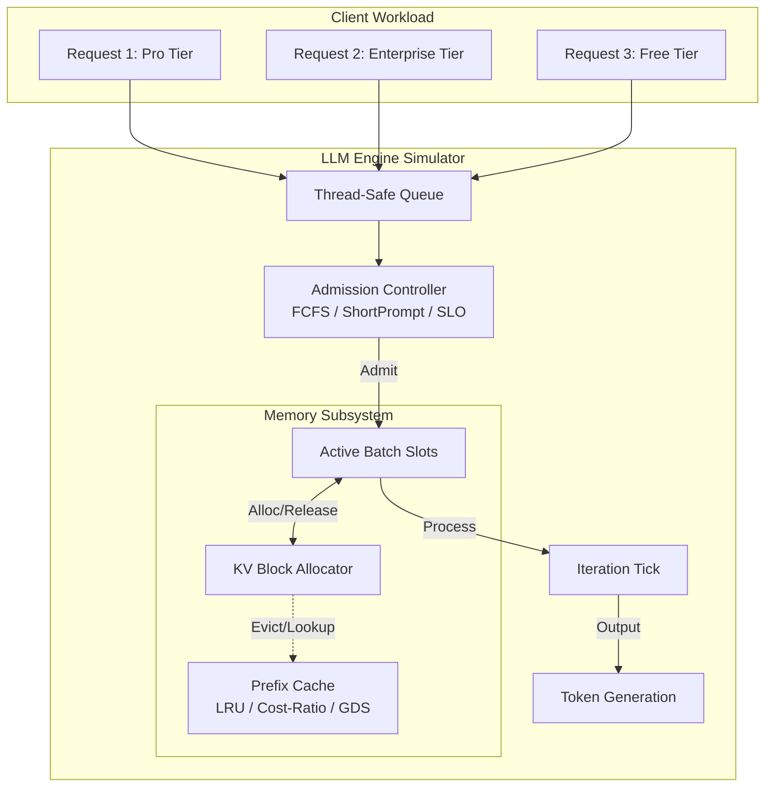
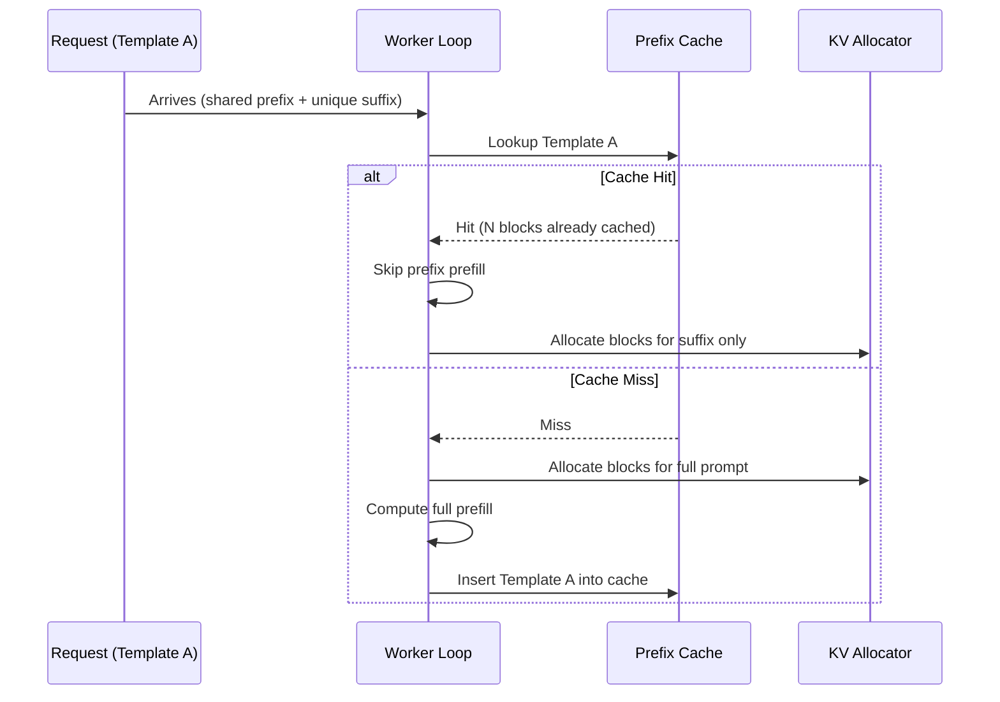
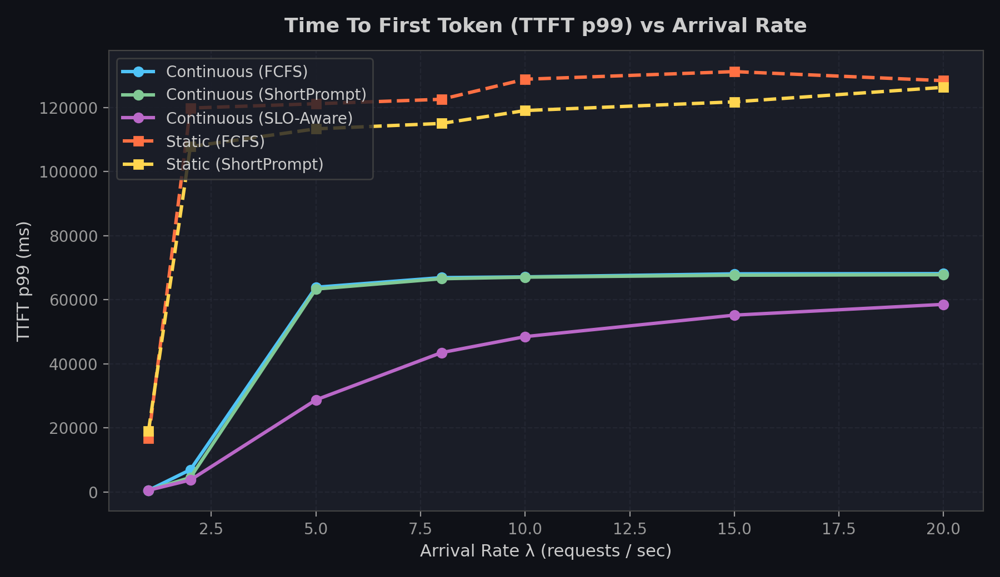
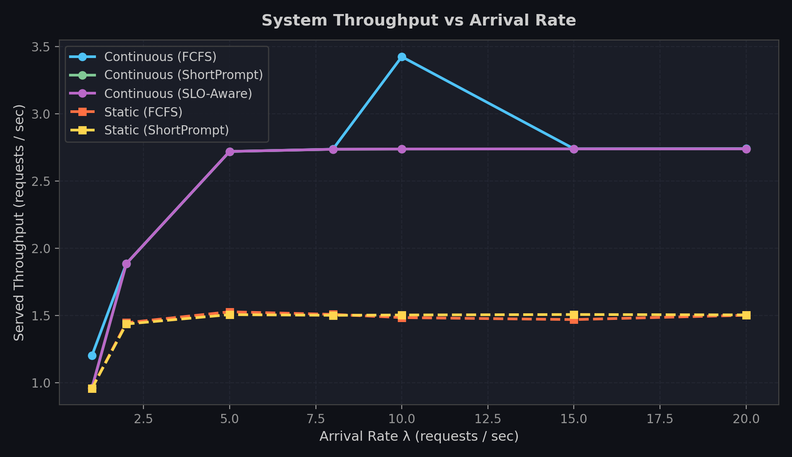
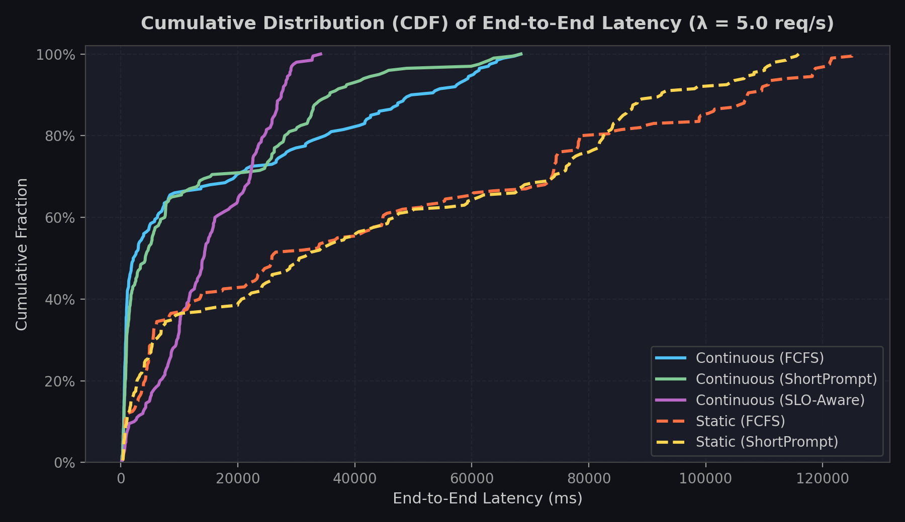
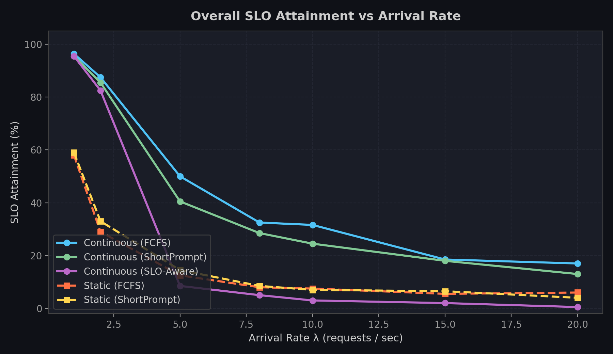

# LLM Inference System Simulator

I've tried to make a C++ simulator for how LLM inference servers actually schedule and serve requests. It models **continuous batching**, **paged KV cache memory**, **tiered SLO scheduling**, and **prefix caching with eviction**, which is the stuff that vLLM/ SGLang deal with under the hood. Note that its just a simulation so no GPU's or real models are needed here. The idea is simply to simulate the two things that actually bottleneck an inference server (compute time and KV cache memory) and use that to test how different scheduling and caching strategies behave. 

---

## How it works

Everything runs through one worker loop (`worker_continuous`) that re-evaluates the batch at every single generation step, meaning a request can join or leave the batch mid flight without waiting on anyone else to finish. That's the "continuous batching" part, as opposed to static batching where you wait for a full batch and run it to completion together (which is also implemented here in `worker_static`, mostly as a baseline to compare against and advance my understanding in chronological order).



Couple more aspects of it worth knowing are:

- **KV block allocator** -> memory is modelled as fixed-size blocks (16 tokens/block by default), the same way vLLM's PagedAttention works. Slots grab blocks as they generate tokens instead of pre-reserving a worst-case chunk of memory.
- **Chunked prefill** -> a long prompt doesn't get prefilled all at once, its split into chunks (`--chunk_size`, 256 tokens by default) so one huge prompt can't hog the compute budget for an entire tick and starve everyone else in the batch.
- **Preemption** -> if the allocator runs out of blocks mid-generation, the lowest-priority active request gets kicked back to the waiting queue (its blocks freed) so a more urgent one can keep going. This is the main source of "thrashing" you'll see in the stats.

## Admission policies

The admission controller decides who gets into the active batch each tick. Three are implemented:

- **`fcfs`** -> first come first served.
- **`shortprompt`** -> admits whichever waiting requests have the cheapest prefill cost first (shortest-job-first, basically). Good for throughput, bad for anyone unlucky enough to send a long prompt.
- **`slo`** -> every request is tagged with a tier (Enterprise / Pro / Free), each with its own time-to-first-token target. This policy sorts by *urgency*, meaning how close a request is to blowing its deadline and admits the most urgent ones first. 

Tier SLOs and traffic mix are currently hardcoded in `get_tier_slo()` and the trace generator: Enterprise gets 200ms, Pro gets 600ms, Free gets 2000ms, and the synthetic traffic is generated as 20% Enterprise / 30% Pro / 50% Free. 

## Prefix caching

If a bunch of requests share a common prefix (a system prompt, a few-shot template, etc.), there's no reason to recompute the KV states for that shared chunk every single time. When prefix caching is on (`--prefix_cache=true`), the first request through a given template pays the full prefill cost and the resulting KV blocks get cached; every later request against that same template skips straight to prefilling just its unique suffix.



Because memory is tight, cached prefixes eventually have to get evicted to make room. Three eviction policies are implemented:

1. **`lru`** -> evict whichever cached prefix has sat idle the longest.
2. **`cost_ratio`** -> evict based on `idle_time / compute_cost`, trying to protect expensive to recompute prefixes. In practice this tends to let heavy prefixes squat in the cache forever(cache pollution), which hurts overall hit rate.
3. **`gds`** -> Greedy-Dual-Size. Scores each entry as `cost/size + L`, where `L` is a running clock that tracks the priority of the last-evicted item. This is the classic fix for the cache-pollution problem `cost_ratio` runs into, and it shows up in the numbers below.

## Benchmarks

All benchmark simulations can be executed via `python scripts/run_benchmarks.py` or `scripts/sweep.ps1`.

### 1. Batching & Latency Dynamics (Continuous vs. Static)

We swept arrival rates $\lambda \in [1, 20]$ req/s across $N=200$ requests under both continuous and static batching modes with different admission policies.

| Policy / Mode (at $\lambda=5$) | TTFT (p50) | TTFT (p99) | Served Throughput | SLO Attainment |
| :--- | :--- | :--- | :--- | :--- |
| **Continuous (FCFS)** | **530 ms** | 63.9s | **2.72 req/s** | **50.0%** |
| **Continuous (ShortPrompt)** | 1,425 ms | 63.4s | **2.72 req/s** | 40.5% |
| **Continuous (SLO-Aware)** | 13,379 ms | **28.8s** | **2.72 req/s** | 8.5% |
| **Static (FCFS)** | 25,369 ms | 121.2s | 1.53 req/s | 12.5% |
| **Static (ShortPrompt)** | 30,469 ms | 113.4s | 1.51 req/s | 14.5% |

- **Time To First Token (TTFT p99)**: Continuous batching significantly lowers prefill wait times by admitting new requests at every generation step instead of waiting for entire static batches to finish.



- **Throughput Saturation**: Static batching quickly saturates around ~1.5 req/s due to idle seat bubbles during decode tail execution. Continuous batching sustains higher throughput (~2.7+ req/s) by keeping slots consistently occupied.



- **End-to-End Latency CDF ($\lambda=5$ req/s)**: Continuous batching curves shift heavily to the left, showing that requests finish much faster without head-of-line blocking.



### 2. Tiered SLO Attainment

Under moderate to high traffic load, admission policies change which requests meet their latency deadlines:

- **FCFS**: Simple queue order; maintains balanced overall completion under medium load.
- **ShortPrompt**: Favors short prompts, improving median latency for lightweight requests at the expense of longer prompts.
- **SLO-Aware (Earliest Deadline First)**: Prioritizes requests close to blowing their tier deadlines, tightly bounding tail latency (p99 TTFT).



### 3. Prefix Caching & Eviction Policies

Ran with $N=500$ requests under a tight memory budget (100 total KV blocks) with shared prompt templates.

**Does prefix caching help?**

| Metric | No cache | Prefix caching (LRU) | Change |
| :--- | :--- | :--- | :--- |
| Total duration | 188.5s | **146.7s** | 22% faster |
| Tokens processed (prefill + decode) | 176,704 | **92,994** | 47% less compute |
| TTFT (p95) | 85.3s | **43.5s** | ~49% lower |
| Preemptions | 82 | **40** | ~51% less thrashing |


**Eviction policy comparison under memory pressure:**

| Metric | LRU | Cost-Ratio | GDS |
| :--- | :--- | :--- | :--- |
| Cache hit rate | 82.78% | 82.22% | **83.33%** |
| Duration | 146.7s | 149.9s | **146.9s** |
| TTFT (p95) | **43.5s** | 46.9s | **43.5s** |


Cost-Ratio can hoard expensive prefixes for too long and lose on both hit rate and speed. GDS balances compute cost against size and recency to achieve the highest hit rate.

---

## Building and running

Only a standard C++17 compiler, no external dependencies.

```bash
g++ -O3 -std=c++17 main.cpp -o main
```
(If your linker complains about pthreads, add `-pthread`.)

**Baseline, no caching:**
```bash
./main --policy=slo --n=500 --num_templates=5 --prefix_cache=false --total_kv_blocks=100
```

**With GDS prefix caching:**
```bash
./main --policy=slo --n=500 --num_templates=5 --prefix_cache=true --eviction=gds --total_kv_blocks=100
```

**Run full simulation suite & plot graphs:**
```bash
python scripts/run_benchmarks.py
```

By default the simulator paces itself in real time to mimic actual request arrivals (`--pace=1`). Pass `--pace=0` for discrete-event fast execution to run multi-sweep benchmarks in seconds.

---

## CLI flags

Full list of flags accepted by `parse_args`:

| Flag | Default | What it does |
| :--- | :--- | :--- |
| `--mode` | `continuous` | `continuous` (iteration-level scheduling) or `static` (classic batch-and-wait) |
| `--policy` | `fcfs` | `fcfs`, `shortprompt`, or `slo` |
| `--n` | `200` | number of requests to simulate |
| `--lambda` | `5.0` | Poisson arrival rate (requests/sec) for the synthetic trace |
| `--seed` | `42` | RNG seed, for reproducible traces |
| `--max_batch_tokens` | `512` | per-tick compute budget, in tokens |
| `--chunk_size` | `256` | max tokens of a single prompt prefilled per tick |
| `--kv_block_size` | `16` | tokens per KV cache block |
| `--total_kv_blocks` | `256` | total KV blocks available (the memory budget) |
| `--num_templates` | `5` | how many of the 5 built-in prompt templates to sample from (0 = no shared prefixes at all) |
| `--prefix_cache` | `false` | turn prefix caching on/off |
| `--eviction` | `lru` | `lru`, `cost_ratio`, or `gds` |
| `--quadratic_cost` | `false` | adds a quadratic term to prefill cost, to simulate attention scaling with sequence length |
| `--pace` | `1` | `1` to sleep in real time to match arrivals, `0` for discrete event fast execution |
| `--out` | `results.csv` | per-request CSV output; `none` to skip |
| `--summary` | `summary.csv` | one summary row gets *appended* per run, so you can point many runs at the same file for sweeps |
| `--verbose` | `false` | also print a line per request to stdout |
| `--ttft_slo` | `500.0` | parsed but currently unused — per-tier SLOs are defined in `get_tier_slo()` |


